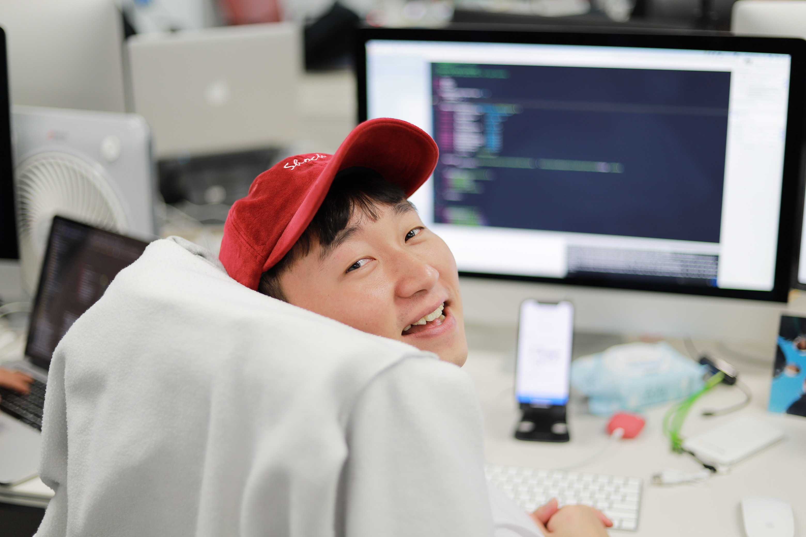
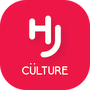

# 이력서

## 소개

- 이름: 진하늘
- 사는곳: 서울
- 닉네임: jinsky
- 취미: 달리기, 넷플릭스, 축구
- 이메일: [jinsky90@naver.com](jinsky90@naver.com)
- 블로그: [https://jinsky90.github.io](https://jinsky90.github.io)

 

빠르지 않은 나이지만 평생 하고싶은 것이 **개발**이라는 것을 알게되었고  
매일 너무 즐겁게 살아가는 **비 전공 개발자 jinsky**입니다. 
**최신 개발 트랜드**에 맞는 기술을 공부하고 적용 해 보는것을 좋아합니다 :)

 

## 회사경력
- [플랫폼로캣티어](https://www.rocateer.com)(2017.07 ~ 12)
- [스테이션3](https://www.station3.co.kr)(2018.01 ~ 11)

## 학력
- 육민관고등학교 졸업(2005 ~ 2008)
- 평생교육진흥원 경영학부 졸업(2014 ~ 2015)
- 평생교육진흥원 경영학과(2018 ~ 재학중)

## 주요 사용기술

### iOS
- Swift
- RxSwift
- MVC, MVVM Pattern
- ReactorKit

### Process
- 모니터링 - Fabric / Google Analytics
- 커뮤니케이션 - Slack
- 이슈관리 - jira / Trello
- 버전관리 - Git(GitKraken / SourceTree)

### Server
- node.js
- Spring

## 해외경험
- 일본 워킹홀리데이(2015.08 ~ 2016.02)

 

## 프로젝트 이력

### [다방](https://apps.apple.com/kr/app/다방-대한민국-부동산-매물-최다보유/id814840066)
- 소개: 대표 부동산 앱
- 기간: 2018.01 ~ 현재
- 관련기술: Swift5.0, MVVM, RxSwift, ReSwift

 

### [다방 방주인](https://apps.apple.com/kr/app/방주인-스마트한-공실-관리/id1438069281)
- 소개: 부동산 공실관리 앱
- 기간: 2018.09 ~ 현재 오픈 후 리뉴얼중
- 관련기술: Swift4.3, MVVM, RxSwift, ReSwift

 

### [HJ컬쳐](https://apps.apple.com/kr/app/hj컬쳐-멤버십/id1300475256)
- 소개: 공연 예약 앱
- 기간: 2017.09 ~ 12
- 관련기술: Swift2.3, MVC

 

### 연애가이드(미출시)
- 소개: 숙박업소 예약 앱
- 기간: 2017/07 ~ 2017.09
- 관련기술: Swift2.3, MVC
